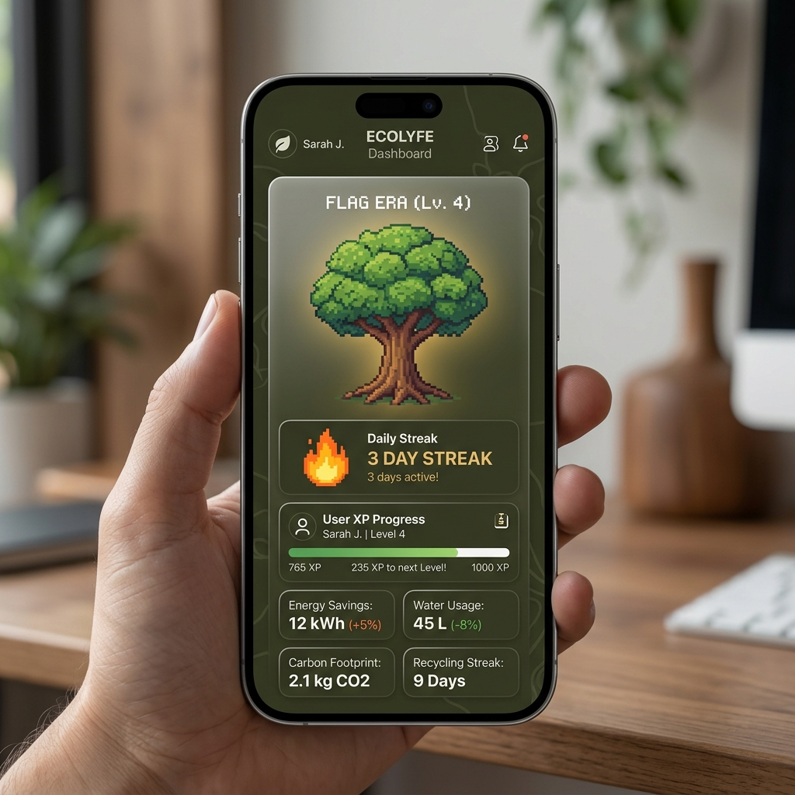
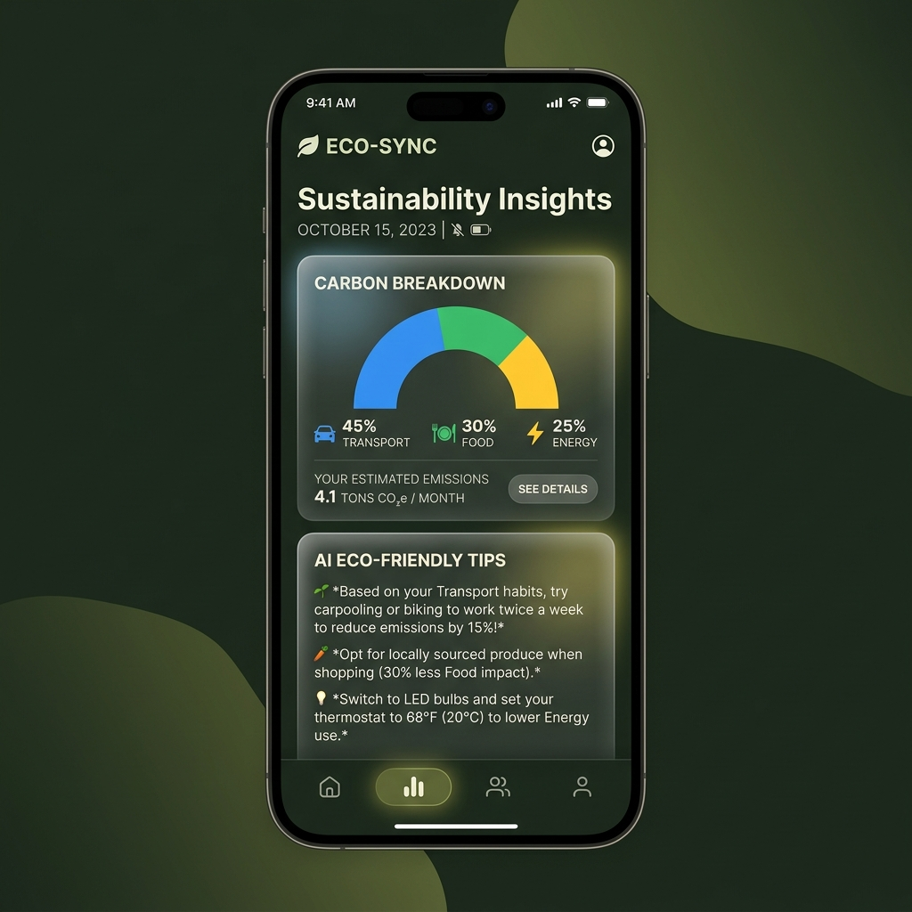
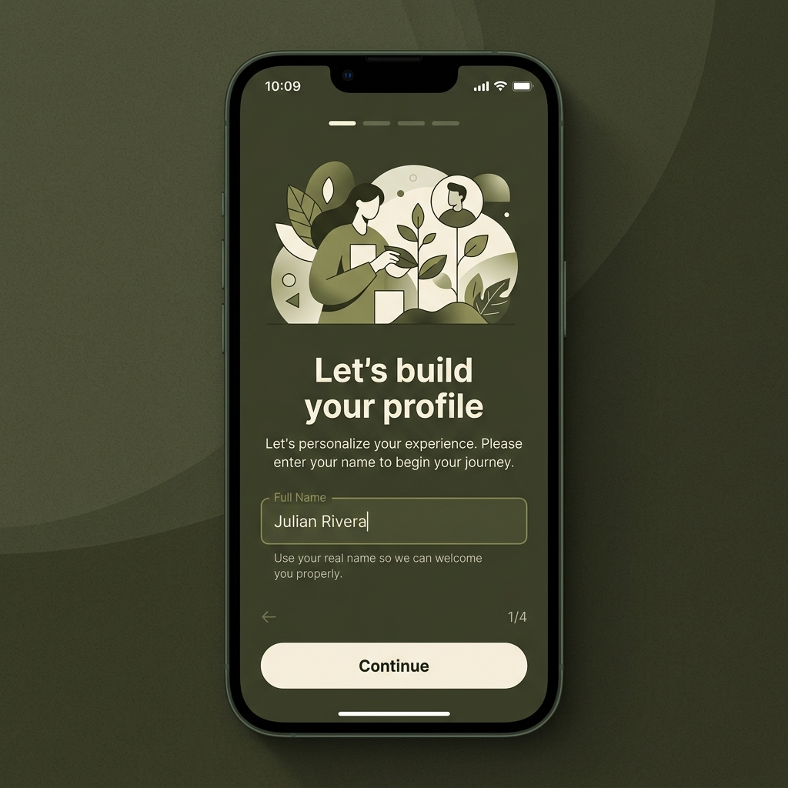
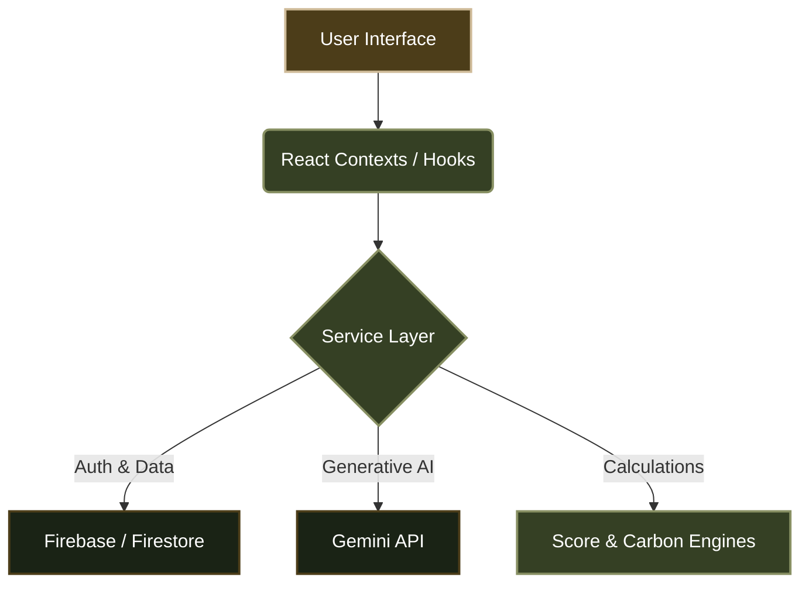

# 🌱 FLAGGED
**Small choices. Measurable impact.**

*A next-generation behavior change platform designed to make sustainability an engaging, daily habit.*

---

## 🌍 Project Overview

FLAGGED is not just another carbon calculator. It is a **student-focused behavior change platform** designed to transform abstract climate concepts into tangible, daily habits. By leveraging gamification, beautiful UI design, and personalized AI insights, FLAGGED helps individuals effortlessly monitor their ecological footprint and gradually shift towards a sustainable lifestyle.

---

## 🎯 Problem We Solve

Our application is meticulously aligned with the core problem statement: *"Design a solution that helps individuals understand, track, and reduce their carbon footprint through simple actions and personalized insights."*

* **🧠 Understand:** We translate raw carbon data into an intuitive "Flag Score" and provide a dedicated **Carbon Breakdown Card** so users clearly understand *why* their score is high or low (e.g., "Transport accounts for 40% of your footprint").
* **📈 Track:** A frictionless, 30-second daily check-in system tracks user choices across Transport, Food, Energy, and Shopping.
* **📉 Reduce:** Gemini AI analyzes the user's historical logs to provide highly personalized, actionable recommendations and "Improvement Challenges" to actively reduce their footprint.

---

## ✨ Features Showcase

| Feature | Description | Technical Implementation |
| :--- | :--- | :--- |
| 🤖 **AI Sustainability Insights** | Personalized lifestyle recommendations based on habit history. | Uses Google Gemini API with 24-hour `localStorage` caching to minimize latency. |
| 📊 **Carbon Impact Tracking** | Daily tracking of transport, diet, AC usage, and shopping habits. | Real-time calculation engines derived from established Emission Factors. |
| 🎮 **Gamified Progress** | Users earn XP, maintain streaks, and evolve their "Flag Era" tree. | Complex `ScoreEngine` mapping 30-day historical trends to user profiles. |
| ♿ **Universal Accessibility** | Features text scaling, high-contrast themes, and reduced motion. | Fully semantic HTML, dynamic ARIA labels, and `aria-live` screen-reader toasts. |

---

## 📸 App Preview

*(Replace these placeholders by adding actual images to `docs/images/`)*

  
  
  

---

## 🏗️ Architecture

The application follows a strictly decoupled, service-oriented architecture.

---

## 💻 Tech Stack

* **Frontend:** React 19, TypeScript, Vite, TailwindCSS
* **Backend / Database:** Firebase Authentication, Cloud Firestore
* **Artificial Intelligence:** Google Gemini API (`@google/genai`)
* **Animations:** Motion (Framer Motion)
* **Testing:** Vitest

---

## 🔄 Data Flow

1. **User Action:** User completes a 30-second daily check-in.
2. **Daily Log:** Data is validated and securely written to Firestore.
3. **Score Engine:** `calculateDailyScore` and `calculateDailyEmissions` process the raw data against environmental constants.
4. **Insights:** The user's updated 30-day history is passed to the `GeminiService`.
5. **Personalized Recommendations:** Gemini generates a custom roasting/forecast which is cached locally and displayed on the Insights tab.

---

## 🛡️ Security Approach

FLAGGED is designed with production-grade security practices:
* **Authentication:** Secure session management via Firebase Auth.
* **Data Isolation:** Frontend queries strictly filter by `where("userId", "==", user.uid)` to prevent unauthorized data access.
* **Environment Protection:** All API keys (Firebase, Gemini) are strictly managed via `.env` variables and `.gitignore`. No hardcoded credentials exist in the source code.
* **Service Workers:** Dynamic configuration injection prevents public credential exposure in static files.

---

## ⚡ Performance & Engineering

* **Code Splitting:** Heavy modals (`SettingsScreen`, `DayDetailsScreen`) and particle effects (`Confetti`) are lazy-loaded via `React.lazy()` and `<Suspense>`.
* **Vite Chunking:** Vendor dependencies (`react`, `firebase`, `motion`) are isolated into `manualChunks` to eliminate large bundle warnings and maximize browser caching.
* **Render Optimization:** All massive context providers and heavy algorithmic derivations are memoized using `useMemo` and `useCallback` to prevent cascading re-renders.
* **Intelligent Caching:** Expensive AI insights are stored in `localStorage` with a strict 24-hour expiry threshold.

---

## 🧪 Testing & Validation

The core logical engines of FLAGGED are fully validated.
* **Framework:** `Vitest` is integrated for rapid unit testing.
* **Coverage:** 12 robust test cases currently cover `ScoreEngine.ts` and `CarbonService.ts`.
* **Resilience:** Tests explicitly validate that engines fail gracefully (without crashing the UI) when fed empty logs, missing variables, or legacy data structures.

---

## 🚀 Future Scope

While FLAGGED is currently a fully functioning prototype, the roadmap for expanding the ecosystem includes:
* **Wearable Integration:** Auto-logging walking and cycling distances via Apple Health / Google Fit APIs.
* **Receipt Scanning:** Using OCR to calculate the carbon footprint of grocery hauls automatically.
* **Social Leaderboards:** Campus-wide or company-wide sustainability challenges to increase engagement.

---

  <i>Built with ❤️ for a greener future.</i>

