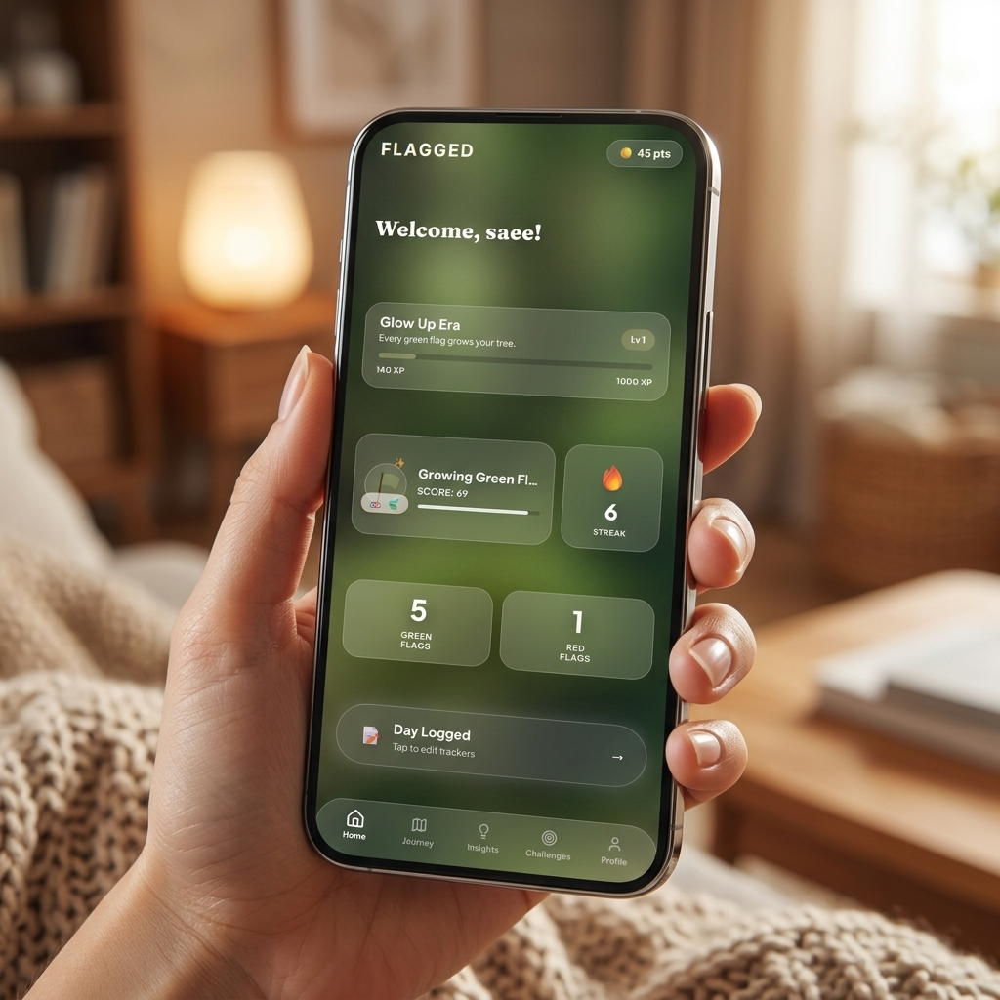
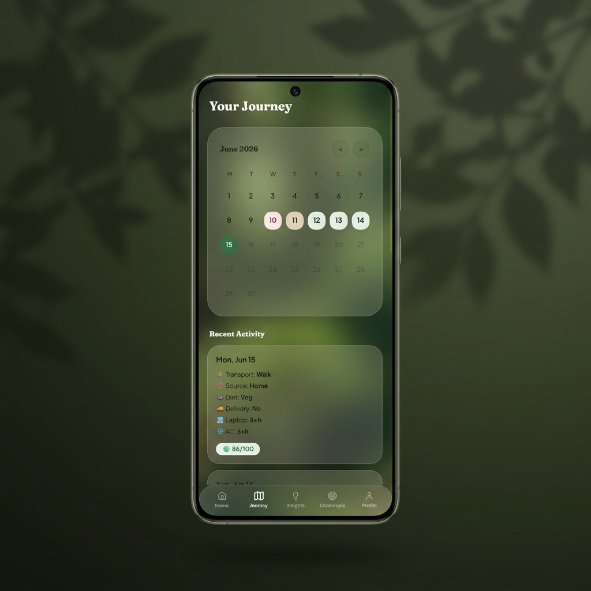
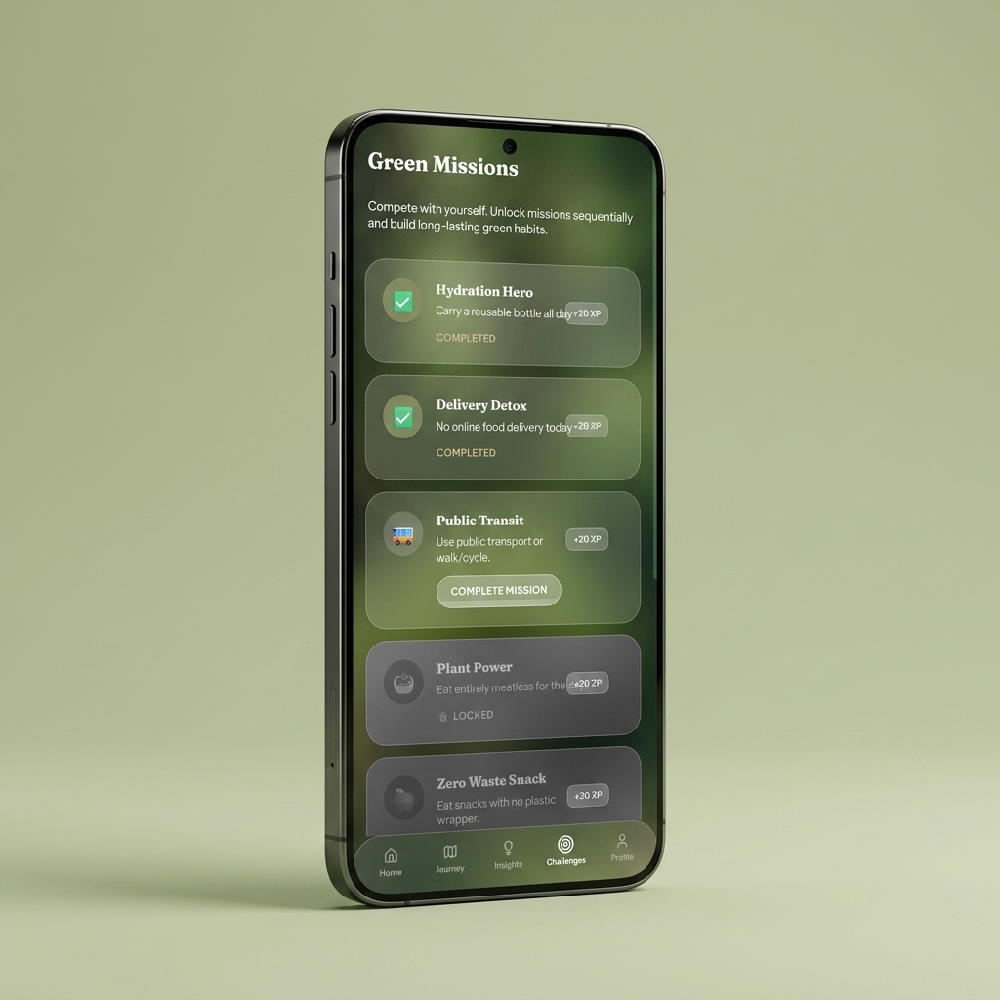
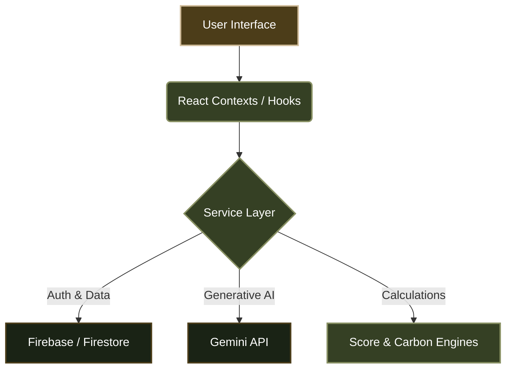

# FLAGGED

 

 

 

---

### ✨ Master Your Footprint

**Gamified, Accessible, and Built for Everyday Impact**

---

### 🌍 Vertical: GreenTech / SustainabilityTech

FLAGGED is a specialized platform for Carbon Footprint Awareness and Behavioral Change. It is designed specifically for students and young professionals who find traditional carbon calculators abstract, tedious, and disconnected from their daily reality.

---

### 🧩 Core Features (Fully Functional Prototype)

* 🤖 **AI Sustainability Insights:** Personalized lifestyle recommendations, "climate roasts," and DNA generation powered dynamically by the Google Gemini API based on actual user logs.
* 📊 **Carbon Impact Tracking:** A frictionless, mobile-first 30-second daily check-in that tracks transport, diet, AC usage, and shopping habits without cognitive overload.
* 🎮 **Dynamic Gamification Engine:** A reactive system where users earn XP, maintain streaks, and visually evolve their "Flag Era" tree based on a rolling 30-day average score. Features **dynamic badges** that unlock by analyzing historical data patterns.
* 🪙 **Closed-Loop Eco Economy:** Users earn points for sustainable choices which can be redeemed in the "Eco Rewards" marketplace for tangible real-world benefits (e.g., planting real trees, local vegan cafe discounts).
* ♿ **Inclusive Accessibility:** Built-in font scaling, high-contrast themes, dynamic ARIA labels, and `aria-live` screen-reader toasts for maximum usability.
* 🔐 **Secure Architecture:** Seamless authentication and real-time syncing via Firebase, with strict Firestore data isolation and `.env` protected API gateways.

---

### 📸 App Preview

  
  
  

---

### 🏗️ System Architecture

---

### 🚀 Approach & Logic

My approach focuses on reducing cognitive load by turning passive data entry into an active, rewarding experience:

1. **Micro-Interactions:** By replacing exhaustive text forms with one-tap icon selections, the platform reduces daily logging friction to under 30 seconds.
2. **Visual Logic:** Instead of just showing a number, the user's progress is visualized through the growth of a "Flag Era" tree, providing immediate emotional feedback.
3. **Actionable AI:** Rather than generic advice, the Gemini integration reads the user's specific 30-day history to provide hyper-contextual tips (e.g., "You drove 4 times this week, try the metro tomorrow").

---

### 🧠 Assumptions Made

* **Mobile-First Reality:** The application is strictly optimized for mobile viewports, assuming users will track habits on the go via their smartphones.
* **Algorithmic Weighting:** The `ScoreEngine` heavily weights recent behavior (last 7 days = 50% weight) over older behavior to ensure the gamification feels highly responsive to immediate lifestyle changes.
* **Local Caching Limit:** It assumes users will check the app daily, hence the strict 24-hour `localStorage` expiration for Gemini Insights to balance API costs with fresh data.

---

### 🛠️ Tech Stack

| Category | Technology |
| :--- | :--- |
| **Framework** | React 19 (Modern, Concurrent UI) |
| **Styling** | Tailwind CSS 4.0 + Framer Motion |
| **Database/Auth** | Firebase (Google Cloud Services) |
| **Artificial Intelligence** | Google Gemini API (`@google/genai`) |
| **Testing** | Vitest (Lightning Fast Unit Testing) |
| **Bundler** | Vite (Optimized Build Flow & Chunking) |

---

   
  <strong>Developed by Saee Kumbhar</strong>

